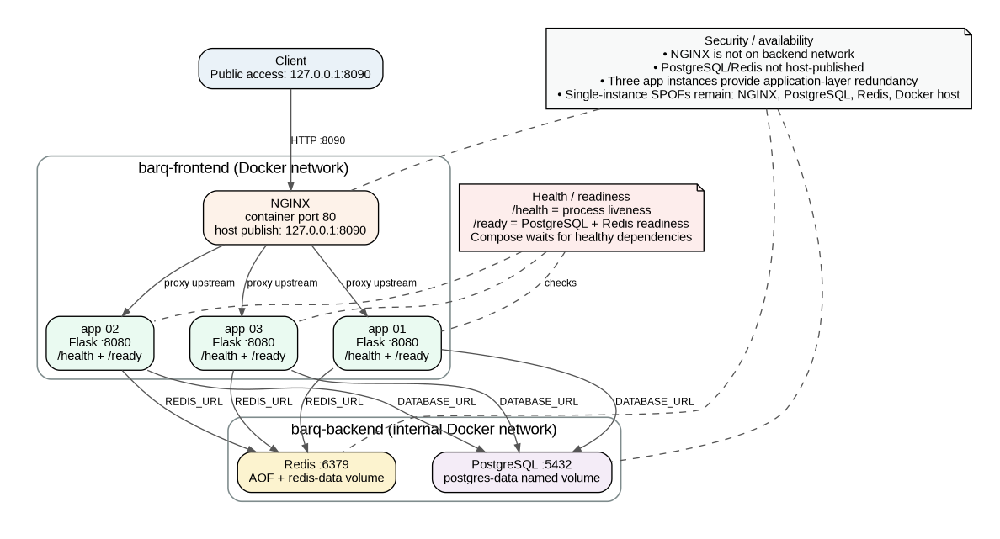

# Final Architecture

## Final state

Three Flask application instances run behind NGINX.

Client -> NGINX :80 -> app-01:8080, app-02:8080, app-03:8080

Public host port: 127.0.0.1:8090

Frontend network: nginx, app-01, app-02, app-03

Backend network: app-01, app-02, app-03, postgres, redis

PostgreSQL:5432 uses the postgres-data named volume.

Redis:6379 uses the redis-data named volume with AOF persistence.

/health checks application liveness; /ready checks PostgreSQL and Redis readiness.

Remaining single points of failure: NGINX, PostgreSQL, Redis, and the Docker host.

The final local validation and failure/recovery tests passed.

The video challenge attempt stopped during preflight before fault injection, so no challenge receipt was generated.
